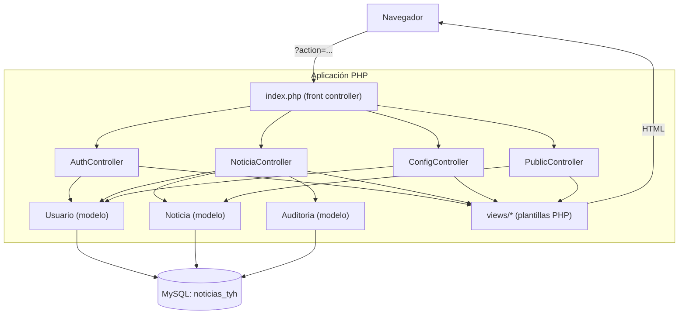
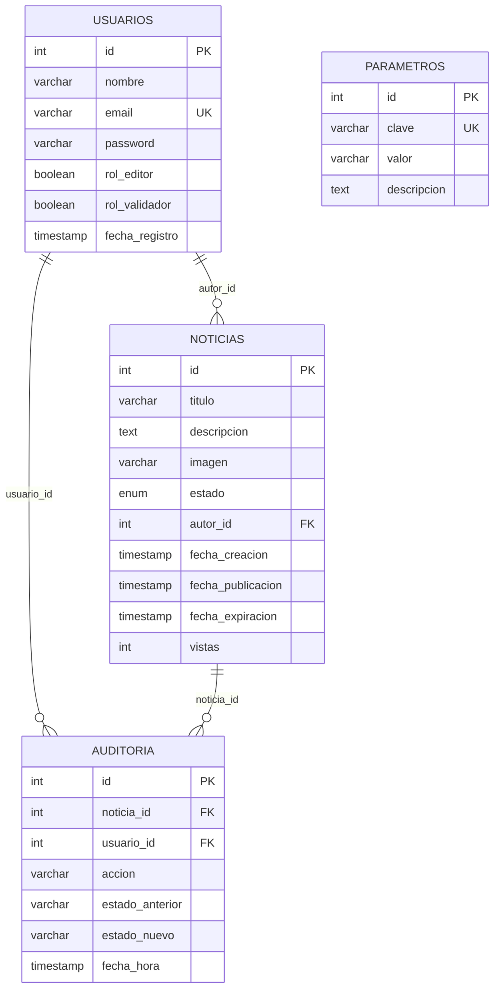

# TyH Noticias

Sistema de gestión, validación y publicación de noticias institucionales, desarrollado en PHP + MySQL con arquitectura MVC manual (sin frameworks).

Trabajo práctico integrador de la materia **Técnicas y Herramientas para el Desarrollo Web con Calidad**, realizado en el marco de una carrera universitaria con foco en testing y calidad de software.

## Índice

- [Funcionalidades](#funcionalidades)
- [Diagrama de arquitectura](#diagrama-de-arquitectura)
- [Diagrama entidad-relación](#diagrama-entidad-relación)
- [Stack técnico](#stack-técnico)
- [Estructura de carpetas](#estructura-de-carpetas)
- [Instalación](#instalación)
- [Usuarios de prueba](#usuarios-de-prueba)
- [Capturas de pantalla](#capturas-de-pantalla)
- [Limitaciones conocidas](#limitaciones-conocidas)

## Funcionalidades

- **Autenticación**: registro y login de usuarios, con contraseñas hasheadas (`password_hash` / `password_verify`).
- **Roles combinables**: Editor, Validador, o ambos a la vez (un usuario con ambos roles actúa como administrador). Al registrarse, cada usuario elige qué rol(es) quiere tener.
- **Gestión de noticias (CRUD)**: creación, edición y anulación de noticias, con carga opcional de imagen (JPG/PNG, tamaño máximo configurable).
- **Flujo editorial con máquina de estados**: `Borrador` → `Lista para Validación` → `Publicada` / `Para Corrección` → vuelve a `Borrador`, además de `Anulada` y `Expirada`. Cada transición se valida contra las transiciones permitidas.
- **Validación editorial**: un usuario con rol Validador puede publicar una noticia o devolverla para corrección.
- **Auditoría**: cada cambio de estado de una noticia queda registrado (quién, cuándo, de qué estado a qué estado), consultable como historial por noticia.
- **Expiración automática**: las noticias publicadas expiran solas una vez transcurridos N días (configurable), sin intervención manual.
- **Parámetros del sistema configurables** por un administrador: días hasta expiración y tamaño máximo de imagen.
- **Sitio público sin login**: listado de noticias publicadas, sección de destacadas, búsqueda por texto y contador de vistas por noticia.
- **Cambio de contraseña** desde el perfil del usuario autenticado.

## Diagrama de arquitectura

> Este diagrama se renderiza automáticamente en GitHub y en editores compatibles con Mermaid (VS Code con la extensión correspondiente, GitLab, etc.).



Todo el ruteo pasa por `index.php`, que despacha según el parámetro `?action=` hacia el controlador correspondiente (no hay `.htaccess` con rutas amigables). Los controladores usan los modelos para hablar con la base de datos vía PDO, y finalmente incluyen (`include_once`) las vistas PHP que arman el HTML de respuesta.

## Diagrama entidad-relación



`PARAMETROS` es una tabla de configuración independiente (clave/valor), sin relación con las demás tablas.

## Stack técnico

- **Backend**: PHP puro (sin framework), MVC implementado a mano, sin autoloading ni Composer.
- **Base de datos**: MySQL/MariaDB, acceso vía PDO con sentencias preparadas.
- **Frontend**: Bootstrap 5 y Bootstrap Icons (vía CDN), JavaScript vanilla para validaciones de formularios en el cliente.
- **Sesiones**: sesiones nativas de PHP (`$_SESSION`) para autenticación y mensajes flash.

## Estructura de carpetas

```
├── index.php                 # Front controller: enruta por ?action=
├── setup.php                 # Crea la base de datos, tablas y usuario admin
├── seed.php                  # Resetea y carga datos de prueba (usuarios + noticias)
├── config/
│   └── database.php          # Configuración de conexión PDO
├── controllers/
│   ├── AuthController.php    # Login, registro, logout, dashboard, perfil
│   ├── NoticiaController.php # CRUD de noticias y flujo de estados
│   ├── ConfigController.php  # Parámetros del sistema y gestión de usuarios
│   └── PublicController.php  # Sitio público (inicio, ver, buscar)
├── models/
│   ├── Usuario.php
│   ├── Noticia.php
│   └── Auditoria.php
├── views/
│   ├── auth/                 # login, registro, perfil
│   ├── noticias/             # crear, editar, validar, historial
│   ├── public/               # inicio, ver, buscar
│   ├── config/                # parámetros del sistema
│   └── layout/                # header y footer comunes
├── assets/
│   ├── css/style.css
│   └── js/main.js
└── uploads/                   # imágenes subidas por los usuarios (se crea en runtime)
```

## Instalación

### Requisitos

- PHP 7.4 u 8.x con la extensión `pdo_mysql` habilitada.
- MySQL o MariaDB.
- Un entorno tipo XAMPP/WAMP/Laragon, o simplemente el servidor embebido de PHP.

### Pasos

1. Cloná el repositorio:

   ```bash
   git clone https://github.com/RibZu/Parte2.git
   cd Parte2
   ```

2. Revisá `config/database.php` si tu MySQL no usa las credenciales por defecto (`root` sin contraseña, `localhost`).

3. Levantá un servidor PHP apuntando a la raíz del proyecto. Con el servidor embebido alcanza:

   ```bash
   php -S localhost:8000
   ```

   (o colocá la carpeta dentro de `htdocs` si usás XAMPP/WAMP y accedé vía Apache).

4. Ejecutá el instalador desde el navegador para crear la base de datos y las tablas:

   ```
   http://localhost:8000/setup.php
   ```

   Esto crea la base `noticias_tyh`, las tablas necesarias y un usuario administrador (`admin@tyh.com` / `admin123`).

5. (Opcional pero recomendado para probar todos los flujos) Cargá datos de prueba más completos — usuarios con distintos roles y noticias en cada estado:

   ```
   http://localhost:8000/seed.php
   ```

   ⚠️ `seed.php` **vacía** las tablas `usuarios`, `noticias` y `auditoria` antes de recargarlas. No lo ejecutes contra una base con datos reales.

6. Accedé a la aplicación:

   ```
   http://localhost:8000/index.php
   ```

## Usuarios de prueba

Los siguientes usuarios se crean al correr `seed.php` (también documentados en `Instrucciones.pdf`):

| Tipo | Email | Contraseña | Roles |
|---|---|---|---|
| Editor | `editor@test.com` | `editor123` | Solo Editor |
| Validador | `validador@test.com` | `validador123` | Solo Validador |
| Dual | `dual@test.com` | `dual123` | Editor + Validador |
| Admin | `admin@tyh.com` | `admin123` | Editor + Validador |

En este sistema no existe un rol "Administrador" separado: cualquier usuario con **ambos** roles (Editor y Validador) obtiene acceso al panel de configuración.

## Capturas de pantalla

| | |
|---|---|
| **Portal público**  | **Búsqueda**  |
| **Detalle de noticia**  | **Login**  |
| **Registro**  | **Dashboard**  |
| **Crear noticia**  | **Editar noticia**  |
| **Validar noticia**  | **Historial / auditoría**  |
| **Configuración del sistema**  | |

## Limitaciones conocidas

Esta sección es deliberadamente honesta: el proyecto es un trabajo práctico universitario, no un sistema en producción. Se dejan documentadas las falencias reales encontradas al revisar el código, en vez de ocultarlas.

- **Credenciales de base de datos hardcodeadas** en `config/database.php` (`root` sin contraseña, sin uso de variables de entorno).
- **Credenciales de prueba expuestas en la propia interfaz**: la pantalla de login y la de registro muestran en pantalla el email y contraseña del usuario administrador.
- **Auto-asignación de roles sin aprobación**: el formulario público de registro deja que cualquier persona se marque a sí misma como Editor y/o Validador (y, al combinar ambos, obtiene de hecho permisos de administrador) sin que nadie lo apruebe.
- **Sin protección CSRF** en ningún formulario (login, registro, cambio de contraseña, alta/edición de noticias, cambios de estado).
- **Cambios de estado ejecutables por GET**: publicar o pedir corrección de una noticia se puede disparar con un simple enlace (`?action=validar_noticia&id=X&accion=publicar`), sin confirmación server-side más allá de la sesión.
- **Validación de archivos subidos solo por extensión**: se comprueba la extensión del nombre de archivo, no el contenido real (MIME), lo que permite subir un archivo con contenido arbitrario renombrado a `.jpg`/`.png`.
- **Vistas referenciadas que no existen en el repositorio**: `AuthController::perfil()` incluye `views/auth/perfil.php` y `ConfigController::usuarios()` incluye `views/config/usuarios.php`, pero ninguno de los dos archivos está en el proyecto — ambas acciones rompen con un error de PHP.
- **Enlace a hoja de estilos roto**: `views/layout/header.php` referencia `assets/css/styles.css`, pero el archivo real se llama `assets/css/style.css` — esos estilos nunca se aplican.
- **Archivo de vista duplicado**: `views/auth/registrar.php` y `views/auth/resgistrar.php` (con un typo en el nombre) son casi idénticos; el segundo no está referenciado por ninguna ruta y parece un archivo residual.
- **Manejo inconsistente de imágenes**: la vista de validación resuelve tanto imágenes subidas como URLs externas, pero las vistas públicas y la de edición solo buscan el archivo en `uploads/`, así que una imagen cargada como URL (como las del set de datos de prueba) no se muestra ahí.
- **Dependencia sin usar**: jQuery se carga desde CDN en el layout principal, pero ningún script del proyecto lo utiliza (todo el JS es vanilla).
- **Sin tests automatizados** en el repositorio, pese a ser el trabajo práctico de una materia orientada a testing y calidad de software.
- **Sin paginación** en los listados públicos ni en el listado de noticias del dashboard.
