# TyH Noticias

Sistema de gestión, validación y publicación de noticias institucionales, desarrollado en PHP + MySQL con arquitectura MVC manual (sin frameworks).

Trabajo práctico integrador de la materia **Técnicas y Herramientas para el Desarrollo Web con Calidad**, realizado en el marco de una carrera universitaria con foco en testing y calidad de software.

## Funcionalidades

- Registro/login con contraseñas hasheadas y roles combinables (Editor, Validador, o ambos = administrador).
- CRUD de noticias con imagen opcional, y flujo editorial por estados: `Borrador → Lista para Validación → Publicada / Para Corrección → Anulada / Expirada`.
- Validación editorial (publicar o pedir corrección) y auditoría de cada cambio de estado.
- Expiración automática de noticias publicadas y parámetros del sistema configurables (días de expiración, tamaño máximo de imagen).
- Sitio público sin login: listado, destacadas, búsqueda y contador de vistas.

## Diagrama de arquitectura

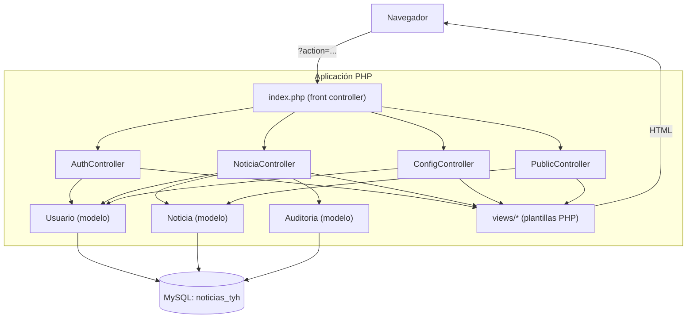

Todo el ruteo pasa por `index.php`, que despacha según el parámetro `?action=` hacia el controlador correspondiente (no hay `.htaccess` con rutas amigables). Los controladores usan los modelos para hablar con la base de datos vía PDO, y finalmente incluyen (`include_once`) las vistas PHP que arman el HTML de respuesta.

## Diagrama entidad-relación

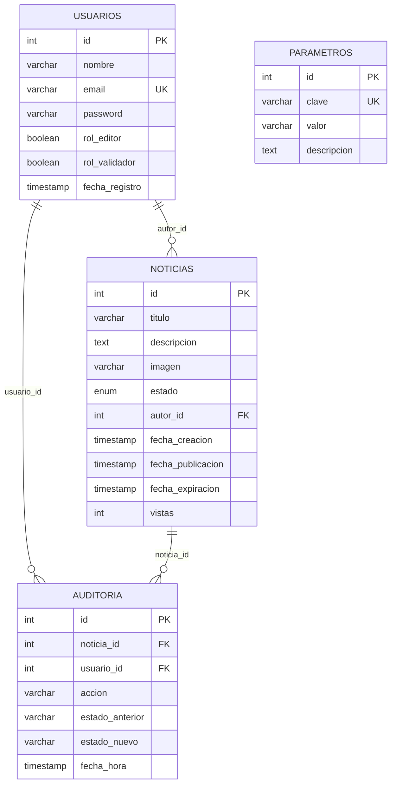

`PARAMETROS` es una tabla de configuración independiente (clave/valor), sin relación con las demás tablas.

## Stack técnico

- **Backend**: PHP puro (sin framework), MVC implementado a mano, sin autoloading ni Composer.
- **Base de datos**: MySQL/MariaDB, acceso vía PDO con sentencias preparadas.
- **Frontend**: Bootstrap 5 y Bootstrap Icons (vía CDN), JavaScript vanilla para validaciones de formularios en el cliente.
- **Sesiones**: sesiones nativas de PHP (`$_SESSION`) para autenticación y mensajes flash.

## Estructura de carpetas

```
├── index.php                 # Front controller: enruta por ?action=
├── setup.php                 # Crea la base de datos, tablas y usuario admin
├── seed.php                  # Resetea y carga datos de prueba (usuarios + noticias)
├── config/
│   └── database.php          # Configuración de conexión PDO
├── controllers/
│   ├── AuthController.php    # Login, registro, logout, dashboard, perfil
│   ├── NoticiaController.php # CRUD de noticias y flujo de estados
│   ├── ConfigController.php  # Parámetros del sistema y gestión de usuarios
│   └── PublicController.php  # Sitio público (inicio, ver, buscar)
├── models/
│   ├── Usuario.php
│   ├── Noticia.php
│   └── Auditoria.php
├── views/
│   ├── auth/                 # login, registro, perfil
│   ├── noticias/             # crear, editar, validar, historial
│   ├── public/               # inicio, ver, buscar
│   ├── config/                # parámetros del sistema
│   └── layout/                # header y footer comunes
├── assets/
│   ├── css/style.css
│   └── js/main.js
└── uploads/                   # imágenes subidas por los usuarios (se crea en runtime)
```

## Instalación

### Requisitos

- PHP 7.4 u 8.x con la extensión `pdo_mysql` habilitada.
- MySQL o MariaDB.
- Un entorno tipo XAMPP/WAMP/Laragon, o simplemente el servidor embebido de PHP.

### Pasos

1. Cloná el repositorio:

   ```bash
   git clone https://github.com/RibZu/Parte2.git
   cd Parte2
   ```

2. Revisá `config/database.php` si tu MySQL no usa las credenciales por defecto (`root` sin contraseña, `localhost`).

3. Levantá un servidor PHP apuntando a la raíz del proyecto. Con el servidor embebido alcanza:

   ```bash
   php -S localhost:8000
   ```

   (o colocá la carpeta dentro de `htdocs` si usás XAMPP/WAMP y accedé vía Apache).

4. Ejecutá el instalador desde el navegador para crear la base de datos y las tablas:

   ```
   http://localhost:8000/setup.php
   ```

   Esto crea la base `noticias_tyh`, las tablas necesarias y un usuario administrador (`admin@tyh.com` / `admin123`).

5. (Opcional pero recomendado para probar todos los flujos) Cargá datos de prueba más completos — usuarios con distintos roles y noticias en cada estado:

   ```
   http://localhost:8000/seed.php
   ```

   ⚠️ `seed.php` **vacía** las tablas `usuarios`, `noticias` y `auditoria` antes de recargarlas. No lo ejecutes contra una base con datos reales.

6. Accedé a la aplicación:

   ```
   http://localhost:8000/index.php
   ```

## Usuarios de prueba

Los siguientes usuarios se crean al correr `seed.php` (también documentados en `Instrucciones.pdf`):

| Tipo | Email | Contraseña | Roles |
|---|---|---|---|
| Editor | `editor@test.com` | `editor123` | Solo Editor |
| Validador | `validador@test.com` | `validador123` | Solo Validador |
| Dual | `dual@test.com` | `dual123` | Editor + Validador |
| Admin | `admin@tyh.com` | `admin123` | Editor + Validador |

En este sistema no existe un rol "Administrador" separado: cualquier usuario con **ambos** roles (Editor y Validador) obtiene acceso al panel de configuración.

## Capturas de pantalla

| | |
|---|---|
| **Portal público** 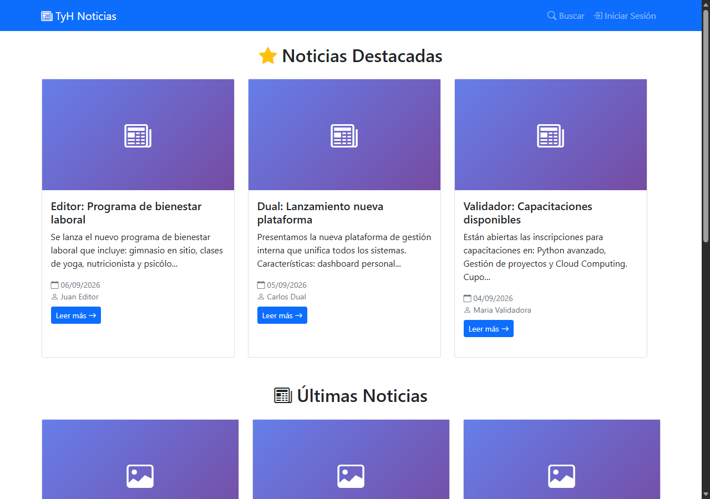 | **Búsqueda** 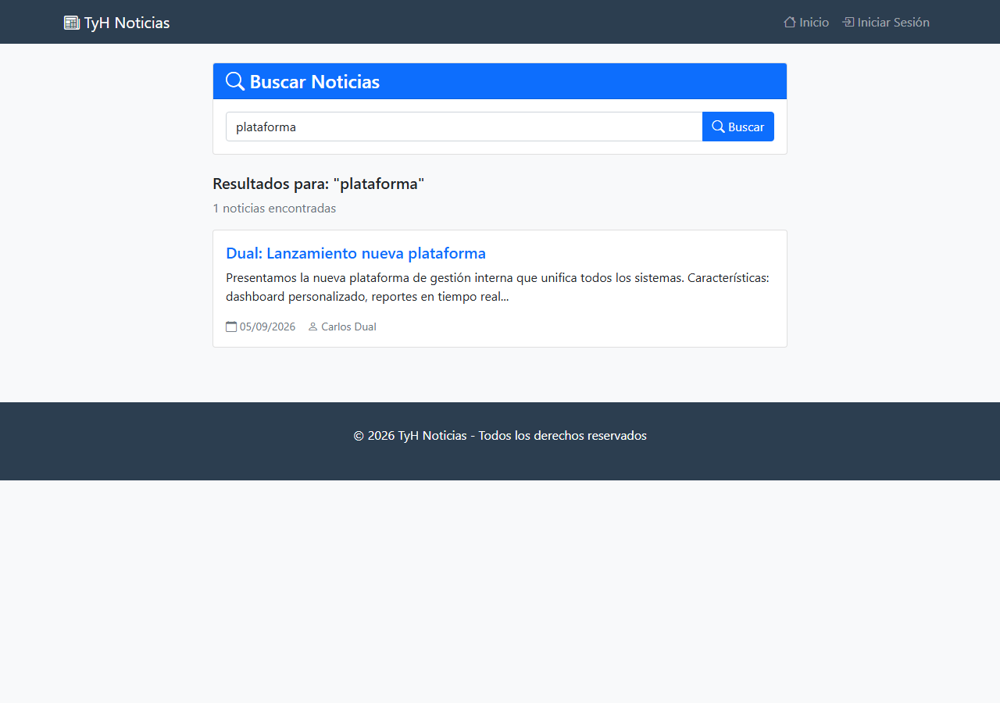 |
| **Detalle de noticia** 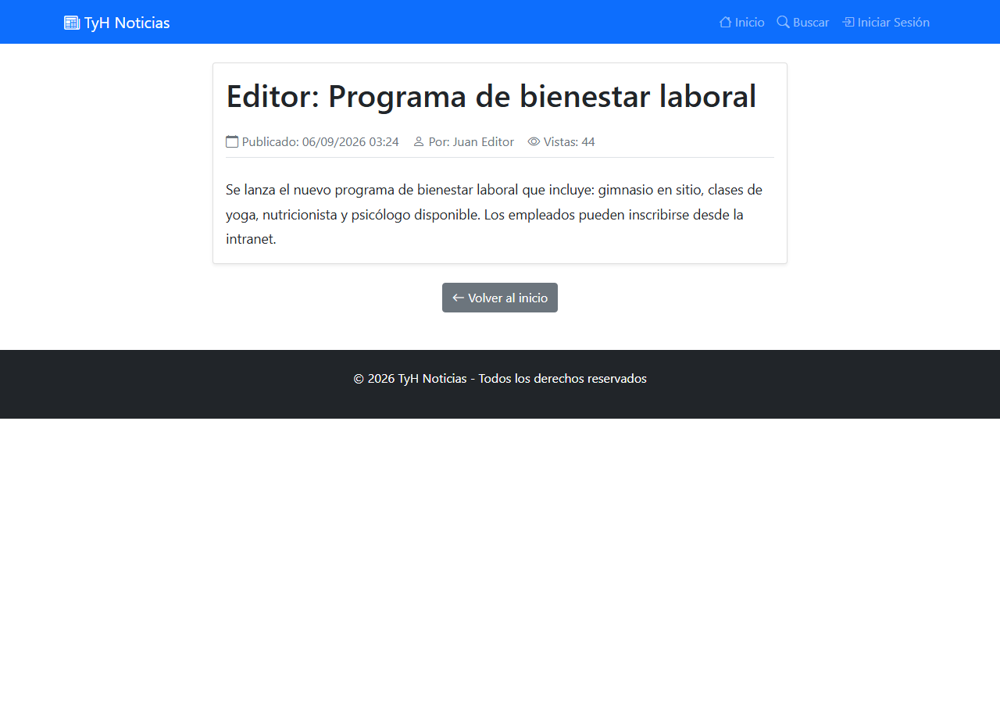 | **Login** 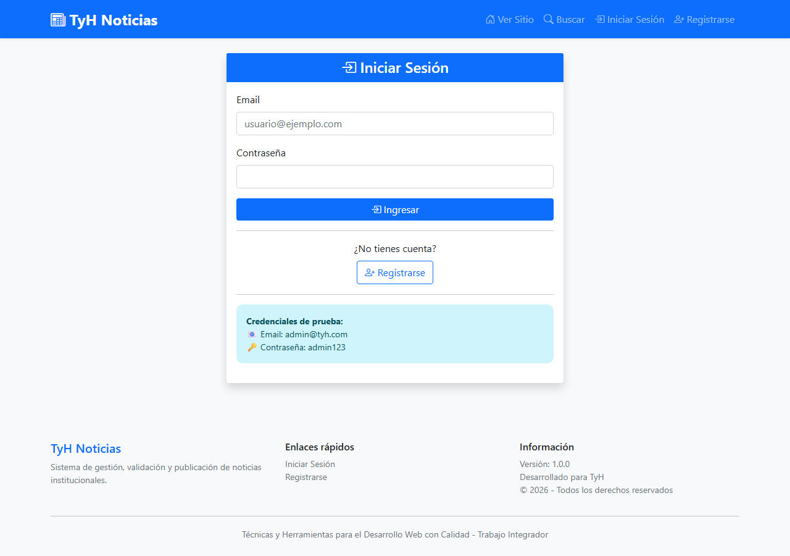 |
| **Registro** 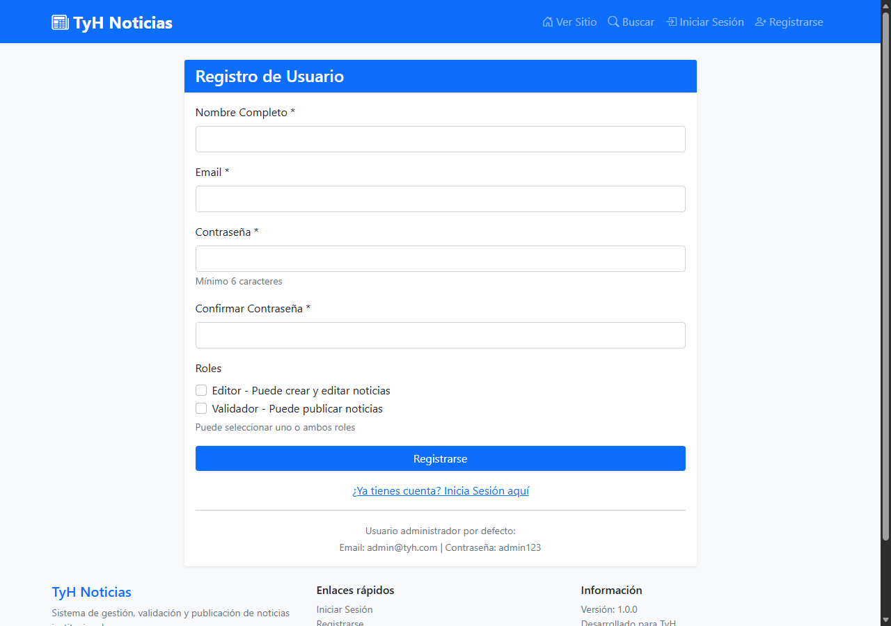 | **Dashboard** 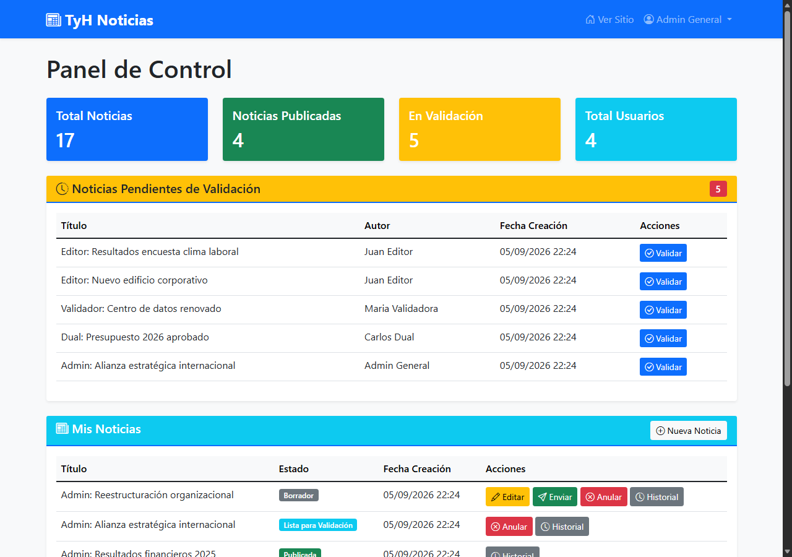 |
| **Crear noticia** 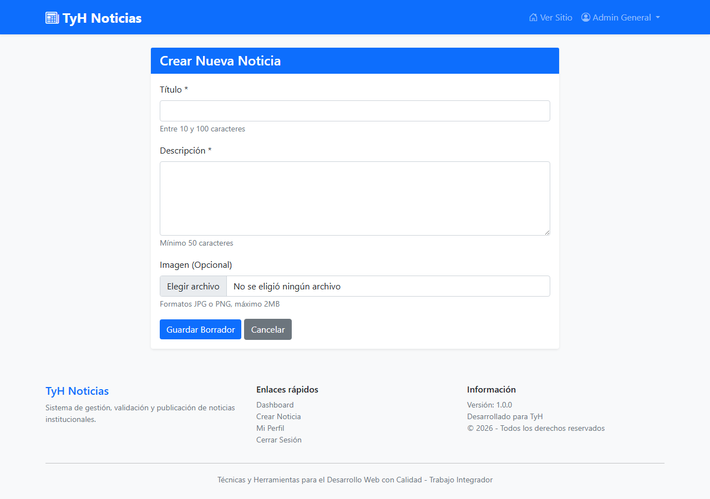 | **Editar noticia** 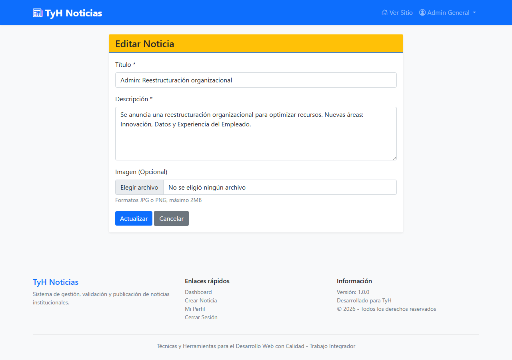 |
| **Validar noticia** 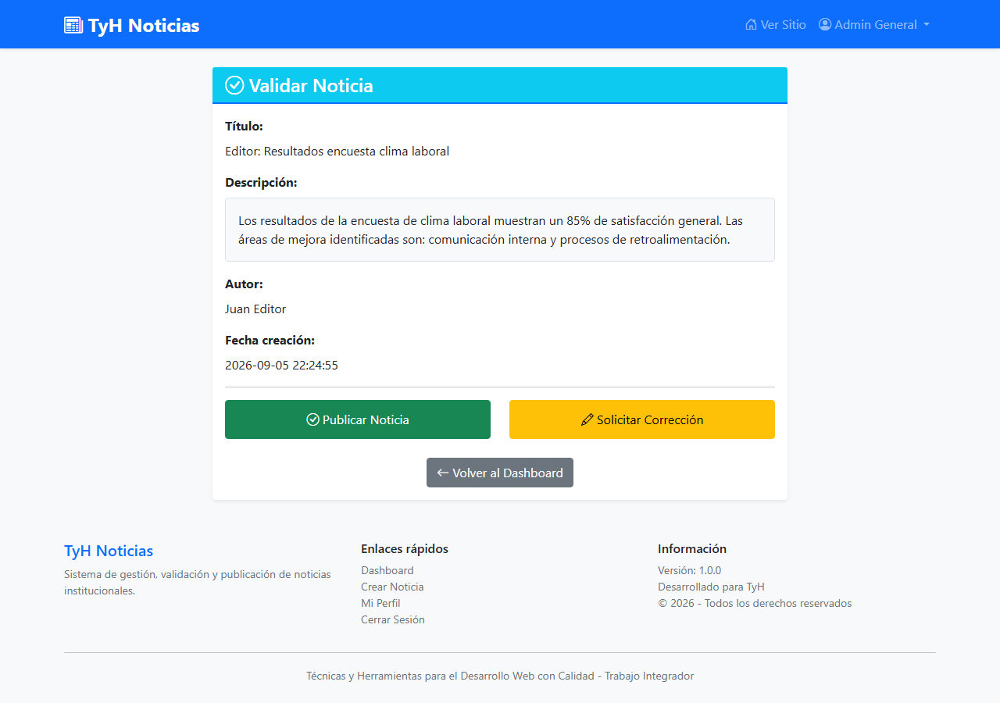 | **Historial / auditoría** 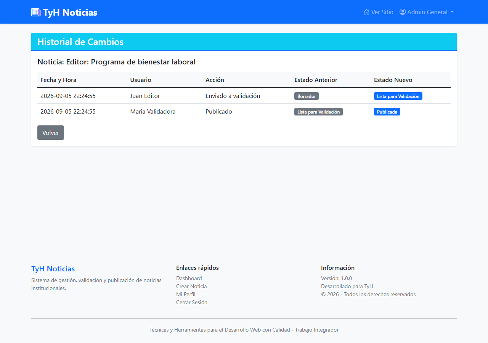 |
| **Configuración del sistema** 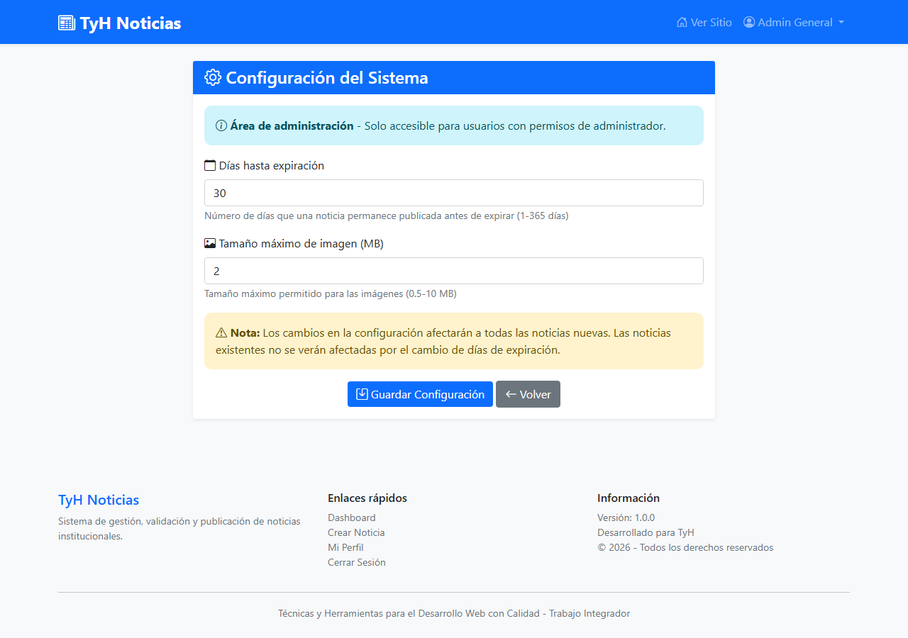 | |

## Limitaciones conocidas

Es un trabajo práctico universitario, no un sistema en producción. Falencias reales detectadas en el código:

- Credenciales de DB hardcodeadas (`root` sin contraseña) y credenciales de admin expuestas en las pantallas de login/registro.
- Auto-asignación de roles sin aprobación: cualquiera puede registrarse como Editor y/o Validador (= admin) sin que nadie lo apruebe.
- Sin protección CSRF, y los cambios de estado de una noticia se pueden disparar por GET con solo un enlace.
- Validación de imágenes subidas solo por extensión, no por contenido real.
- Dos vistas referenciadas por los controladores (`views/auth/perfil.php`, `views/config/usuarios.php`) no existen en el repo y rompen esas pantallas.
- Un enlace a CSS roto (`styles.css` vs. `style.css`) y un archivo de vista duplicado (`resgistrar.php`, typo, sin uso).
- jQuery cargado pero nunca usado; sin tests automatizados; sin paginación en los listados.
